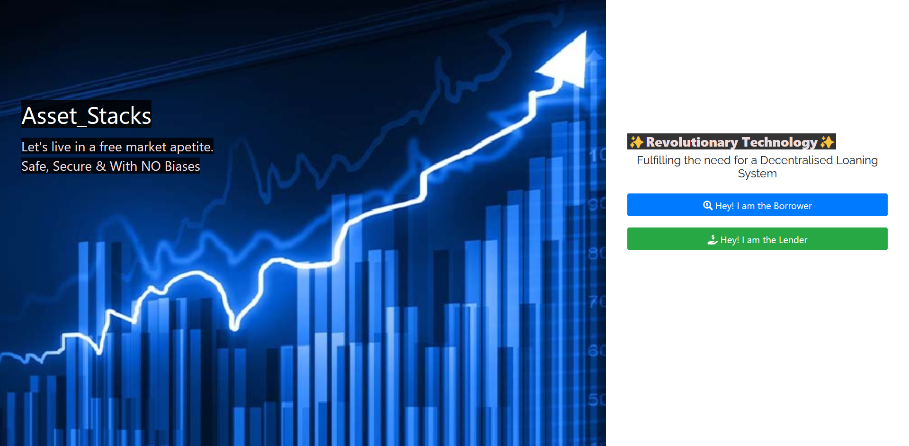

# Asset_Stacks

### Asset_Stacks is a blockchain-based peer-to-peer lending platform that allows ordinary people to obtain loans without the inconvenience of dealing with banks or local lenders, and eliminates the cumbersome screening and paperwork procedures. :bank:

        

Table of Contents
 
<ol>
 <li>
 <a href="#problem-statement">Problem Statement</a>          
 </li>
  <li>
 <a href="#proposed-solution">Proposed Solution</a> 
   </li>
 <li>  
   <a href="#project-design">Project Design</a>     
 </li>       
 <li>
   <a href="#features">Features</a>
</li>                
 <li>         
   <a href="#technologies-used">Technologies Used</a>       
 </li>
 <li>         
   <a href="#next-steps">Next Steps</a>       
 </li>                 
 </ol>         
 
         
          
   
       
          
   # Problem Statement
   
   There are two main parties who provide loans to people, those are -:
   
   ## Banks
   *   Banks provide loans at a very high interest rate and they have a very lenghty and biased screening process. 
   *   Following the 2008 recession, obtaining loans has become even more challenging due to the widespread issue of people being unable to repay the loans they received, and the inability to sell their properties due to the properties' plummeting value. 
   *   Banks are hesitant to take on risks and often exhibit biases based on factors such as caste, religion, financial background, among others.
   ## Lenders
   *   Lenders take high and unfair rates of interest where the entire power lies in their hands and leaves the borrowers vulnerable to exploitation. 
   *   The lenders hold the authority to raise the interest rate beyond the initially agreed upon amount at a later stage.
    
  

   
   # Proposed Solution 
   
   Asset_Stacks overcomes all these complications by providing a decentralised system of peer-to-peer lending where no single entity has the whole power and is able to harness the full potential of Web 3.0 by offering the following advantages -:
   * **Transparency :** The whole process is decentralised where neither of the parties has all of the power. The platform connects the borrower directly to the lender and there is no middleman involved.
   *  **Immutability :** Since blockchain is immutable, the interest rate once decided upon cannot be changed later in any unfair manner. Prior to lending, the lender determines the desired interest rate, whilethe borrower selects an interest rate from those presented by various lenders.
   *  **Security :** Blockchain also eliminates the concern of lenders regarding loan repayments. In case the borrower fails to repay the loan by the stipulated due date, the lenders can seize the mortgage submitted by the borrower and auction it off.
    
          
 
         
          
  # Project Design
 

        

          
 
         
          
  # Features        
 
 > As of now we are using a decentralised public IPFS gateway. To use our DApp generate your file CID [here](https://www.dreamlink.cloud/) before adding it as a mortgage.
 
 <ol>
          
  * Borrowers can create their loan proposal with the amount they want, their favourable repayment due date and CID of their mortgage uploaded on IPFS
  
           
          
  * Lenders can verify the borrower's data and send their proposal with their favourable interest rate. 
  
    
    
  * Borrower can then accept the loan if they like the interest rate.   
    
    
    
  * Once again at the lender page, once the confirmation from the borrower has arrived, the funds can be disbursed from the lender's account to the borrower's account.
    
    
    
    
  * After accepting the loan, the borrower can pay anytime before the due data. If the repayment date has passed, the borrower cannot repay the loan and their mortgage will be revoked and auctioned off. 
  
      

</ol>
          
   
       
   
   # Technologies Used
   
1. Ethereum 
2. Solidity
3. Truffle
4. MetaMask
5. JavaScript
6. Ganache
7. Web3
8. jQuery
 
  
  
 
 # Next Steps
 
 * Creating a way to dwelve into other forms of mainstream currency other than crypto for scalability
 * Improving UI/UX of the website
 * Credit system for the future so that mortgage may not be necessary for future repayments
 * Having an more robust manner to verify the mortgages
 
 ------       
 
 ### Made with <3 by

[Zuber Rahman](https://github.com/zuberrahman)
:prince:

[Riya S](https://github.com/Rrs-4817)
:trollface: